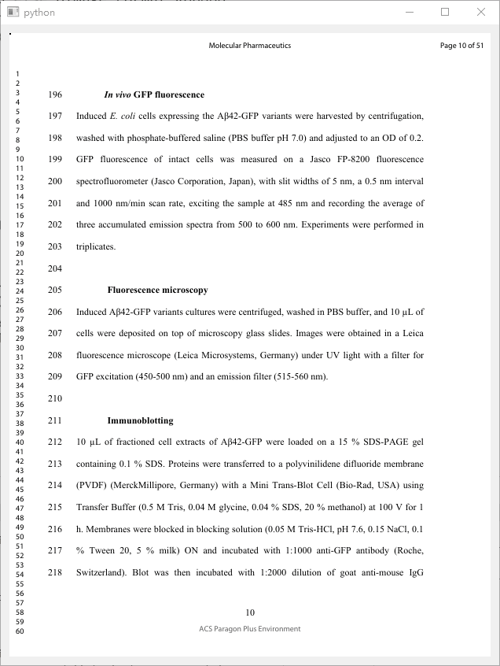

# pdf tools
 Small pyqt application to crop the margins or compress the pdf. 

# Usage
## Crop PDF
1. Use Tool -> Crop
## Compress PDF
1. Use Tool -> Compress

# Screenshot

# Requirements
1. pyqt5
2. pymupdf
3. [ghostscript==9.25](https://github.com/ArtifexSoftware/ghostpdl-downloads/releases/tag/gs925) (version 10.0 not working) 

# Notes
* All pages in the pdf will be cropped according to the area you selected. 
* Instead of setting visible area of the pdf, the texts beyond visible area are removed by ghost script.